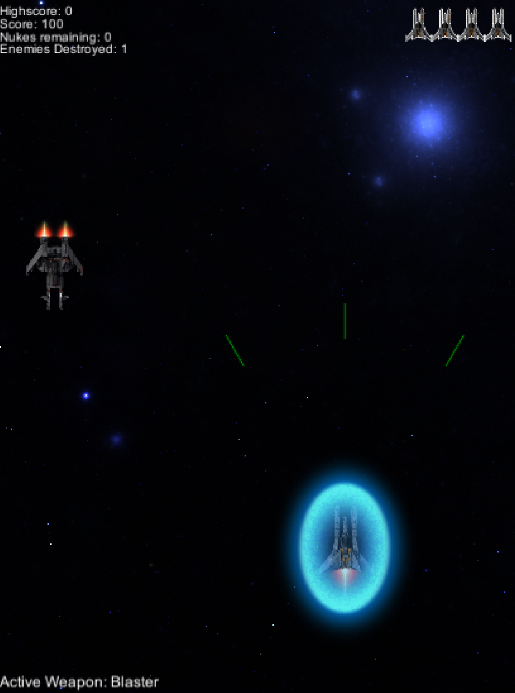
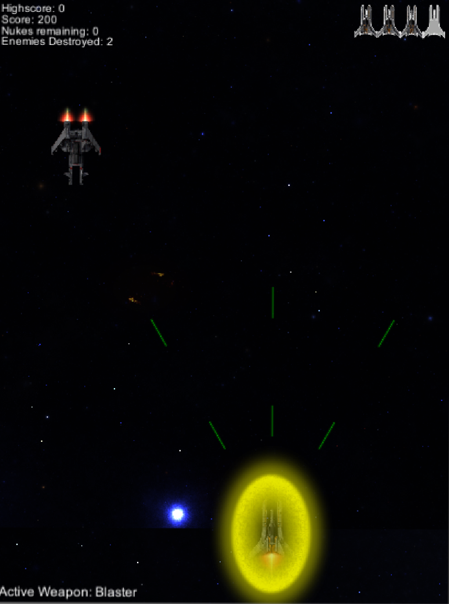

# Space Shooter
## Instructions for running the game

Inside nbattel_shump, download the Build.zip folder. Once you've downloaded and unzipped it you can find the nbattel_shump.exe to execute the game.

